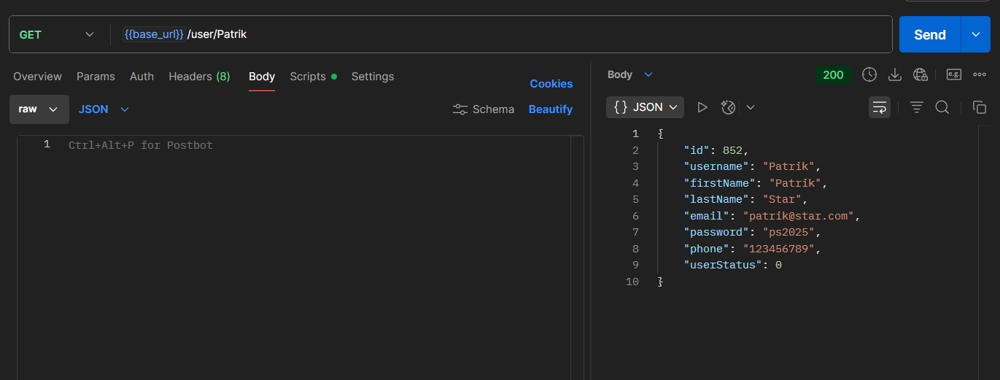
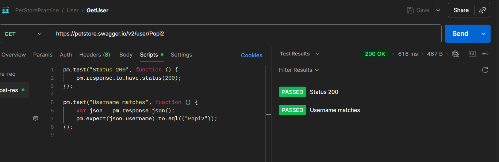

# 🟢 GET Request Test

This test verifies that the API correctly updates an existing user resource when a **GET** request is sent.

---

## 🔹 Endpoint
`{{base_url}}/Patrik`

---

## 🔹 Test Description
The purpose of this test is to confirm that the server:
- Successfully retrieves an existing resource through a **GET** request  
- Returns a **200 OK** status code   
- Displays all expected fields in the response body (eg. id, name, status, etc.)
- Ensures the data format (JSON) and field types are valid 

---

---
## GET request

# 🟢 GET Negative Request Test

This test verifies that the API correctly updates an existing user resource when a **GET** request is sent.

---

## 🔹 Endpoint
`{{base_url}}/user/Patrik42545`

---

## 🔹 Test Description
The purpose of this test is to confirm that the server:
- Returns an appropriate error when a non-existing username is requested  
- Does not return a 200 OK status   
- Returns a meaningful error message in the response body (404 Not Found)

---

---
## GET request

