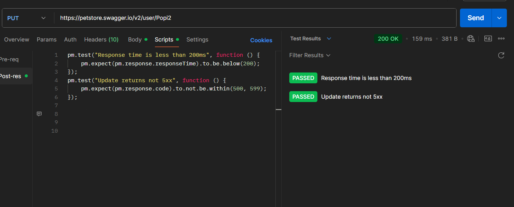

# 🟢 PUT Request Test  

In this test, I verify whether the API correctly updates an existing user resource when a **PUT** request is sent.  

---

## 🔹 Endpoint  
`{{base_url}}/user/Popi2`  

---

## 🔹 Test Description  
The purpose of this test is to confirm that the server:  
- Accepts valid update data for an existing user  
- Returns a **200 OK** status code  
- Reflects all modified fields correctly in the response body  
- Keeps unchanged fields intact  

---

## 🔹 Preconditions  
- The user already exists in the system (created previously via **POST**).  
- Correct username is provided in the URL.  

---

## 🔹 Request Example  
**Method:** PUT  

**Body (raw JSON):**  
```json
{
  "username": "Popi2Update",
  "firstName": "Sokol2",
  "email": "popi2@test.com",
  "password": "passwordPopi",
  "phone": "0000000000",
  "userStatus": 1
}

```
---
## PUT request


