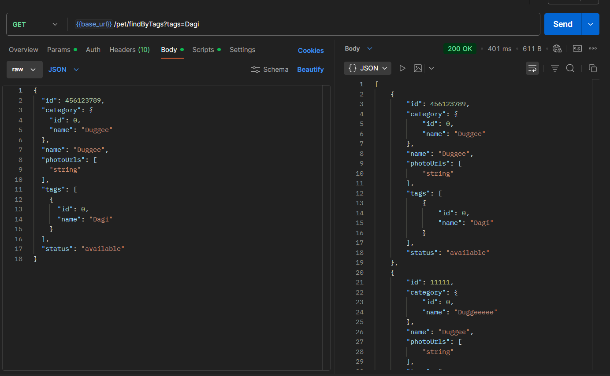
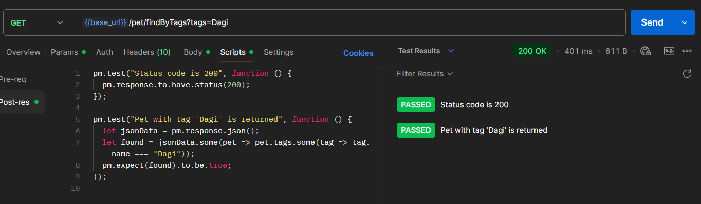

# 🟢 GET Request Test

This test verifies that the API correctly retrieves pets by given tag.

---

## 🔹 Endpoint
`{{base_url}}/pet/findByTags?tags=Dagi`

---

## 🔹 Test Description
The purpose of this test is to confirm that the server:
- Successfully retrieves an existing resource through a **GET** request  
- Returns a **200 OK** status code   
- Returns that pets with tag 'Dagi' are displayed

---

---
## GET request

