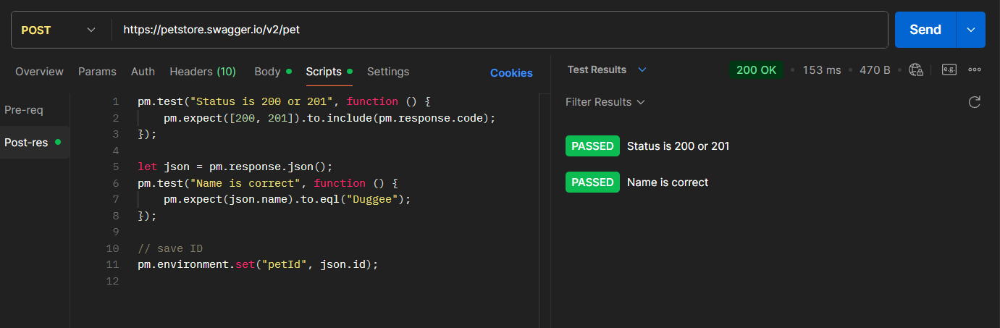

# 🟢 POST Request Test

In this test, I verify whether the API correctly creates a new resource when a POST request is sent.

---

## 🔹 Endpoint
{{base_url}}/pet

---

## 🔹 Test Description
This test checks if the server accepts valid data and returns the expected response with a `200 OK` status code.  
I also verify that all submitted parameters are correctly saved and returned in the response body.

---

## 🔹 Request Body (example)
```json

{
  "id": 456123789,
  "category": {
    "id": 0,
    "name": "Duggee"
  },
  "name": "Duggee",
  "photoUrls": [
    "string"
  ],
  "tags": [
    {
      "id": 0,
      "name": "Dagi"
    }
  ],
  "status": "available"
}

```
---
## POST request

